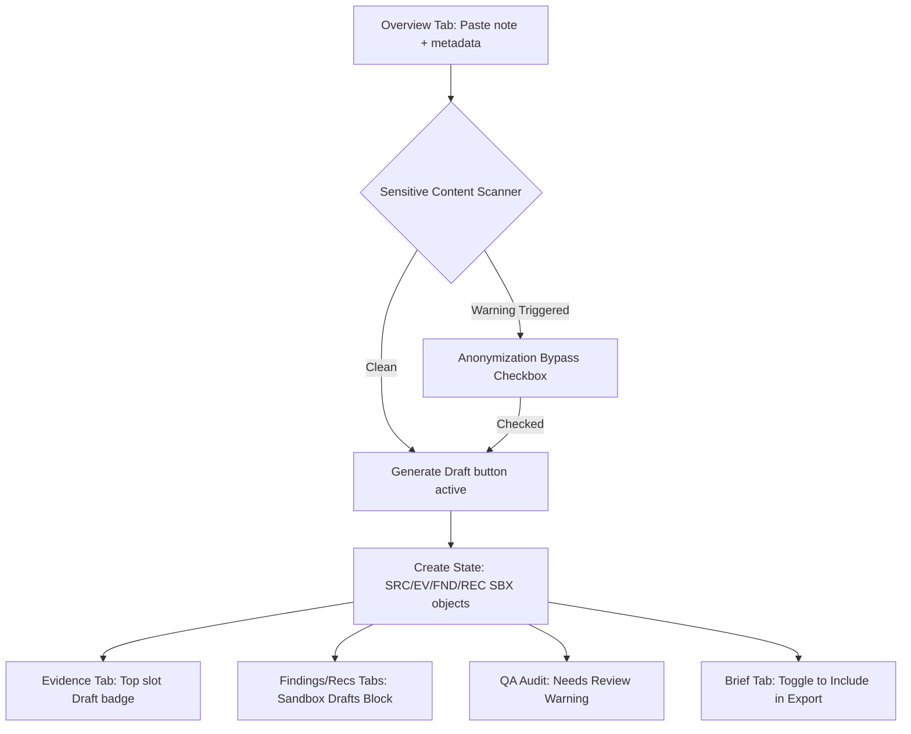

# Design and Implementation Plan: v0.8 Local Note Intake Workflow

This document outlines the scope, visual design, deterministic parsing, safety checks, and integration logic for the v0.8 local-only field note intake workflow in Field Learning Studio.

---

## 1. Feature Scope & Boundaries

### Included
- **Paste Note Intake Panel:** A dedicated structured input form inside the Overview tab.
- **Source Context Inputs:** Select boxes for Stakeholder Group, Data Type, Theme, and Sensitivity Level, plus an optional anonymized Site Label text field.
- **Sensitive Content Checker:** A local Regex-based scanner that warns users if names, exact dates, emails, phone numbers, or trigger words (e.g., abuse, violence) are entered.
- **Deterministic Parser:** Non-AI local mapper that generates temporary structured draft objects (`SRC-SBX-XXX`, `EV-SBX-XXX`, `FND-SBX-XXX`, `REC-SBX-XXX`).
- **Workspace Integration:**
  - Sandbox draft evidence entries display at the top of the Evidence tab with a "Sandbox draft" badge.
  - Sandbox drafts findings and recommendations display in dedicated "Sandbox Drafts" blocks on their respective tabs.
  - Traceability Drawer fully supports navigating sandbox IDs.
  - QA Scanner warns about unvalidated sandbox content.
  - Brief Tab includes a toggle to optionally export sandbox content, default to Off.
- **Export Packaging:** Markdown, Word, and PDF files conditionally append sandbox drafts under a distinct warning section if the toggle is active.

### Excluded (Out of Scope for v0.8)
- File uploading (`.csv`, `.xlsx`, `.pdf`).
- Google Sheets API sync.
- LocalStorage or database persistence (disappears on reload).
- External AI API calls for categorization.

---

## 2. Safety Boundaries

1. **Client-Only execution:** All parsing, checks, and formatting happen locally in React state. No network requests are made.
2. **Clear Warning Copy:** A prominent message informs the user that text is not uploaded, saved, or analyzed by an external AI service.
3. **Anonymization Gate:** If the sensitive scanner triggers, the user must check a box confirming the note is anonymized and safe before generating draft evidence.

---

## 3. Data Model Approach

Sandbox records will follow standard TypeScript interfaces but use the `SBX` prefix:
*   **Source ID:** `SRC-SBX-[counter]`
*   **Evidence ID:** `EV-SBX-[counter]`
*   **Finding ID:** `FND-SBX-[counter]`
*   **Recommendation ID:** `REC-SBX-[counter]`

### Deterministic Theme-based Interpretation Mapping
- **Access:** `"Access conditions may be affecting participation or service uptake."`
- **Safety:** `"Safety or protection concerns may be shaping participation and should be reviewed before donor-facing use."`
- **Nutrition:** `"Food acceptability, water, or nutrition-related implementation factors may be influencing programme experience."`
- **Coordination:** `"Implementation coordination may be affecting consistency, coverage, or follow-up."`
- **Inclusion:** `"Some groups may face barriers to meaningful participation or access."`
- **Other Themes (Safety/Participation/Training/Accountability/etc.):** Dynamic fallback phrasing like `"Theme [Theme Name] conditions may be influencing programme implementation."`

---

## 4. UX Flow & Layout

---

## 5. Export Integration Plan

- **buildBriefExportModel.ts:** Updated to map a new array parameter `sandboxEvidence`, `sandboxFindings`, etc., or conditionally flag them.
- **Word / PDF / Markdown Generators:** If `includeSandbox` is true, append a clean annex section:
  `## Sandbox Draft Evidence — Requires Review`
  with user observations, theme mappings, draft findings, draft recommendations, and warning labels.
