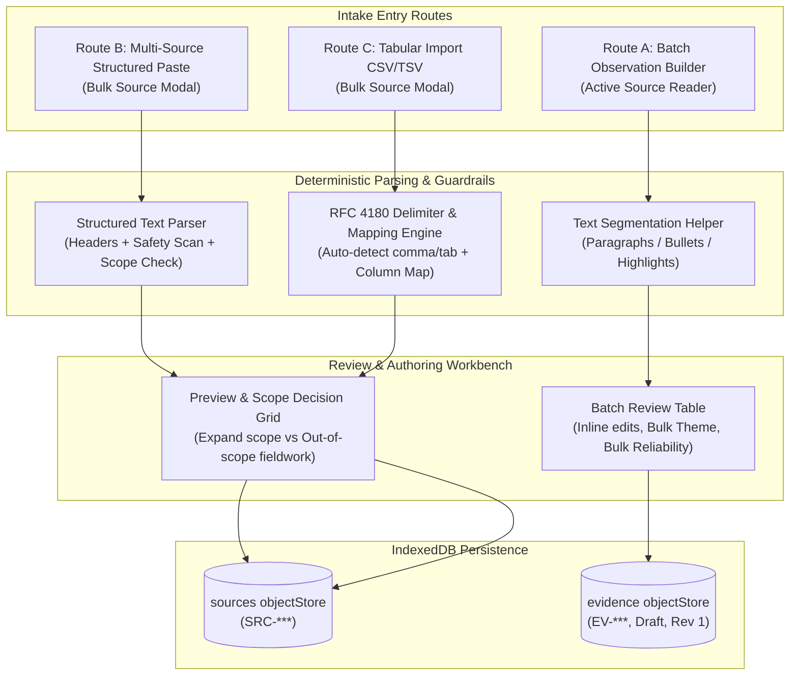

# Field Learning Studio: Bulk Intake & Structured Import Guide (v0.9 Phase 7)

## Executive Summary

Phase 7 introduces the **Bulk Intake & Structured Import Engine** to eliminate the manual data-entry bottleneck in Field Learning Studio. In realistic fieldwork, evaluators and monitoring teams collect dozens of interview notes and observations in a single day. Entering these records one-by-one is prohibitive.

Phase 7 provides three deterministic, client-side intake routes while strictly preserving the integrity of the evidence-to-learning chain:

1. **Route A (Highest Frequency): Batch Observation Builder** – Rapidly extract, review, theme, and score multiple candidate observations from a single source note before committing them as Draft evidence.
2. **Route B: Multi-Source Structured Paste** – Ingest multiple formatted interview/focus-group blocks separated by `---` with automated header parsing, ethics defaults, and scope mismatch handling.
3. **Route C: Tabular Import (CSV / TSV)** – Ingest tabular field logs or survey extracts via text paste or file upload with automated delimiter detection, column mapping, and preview validation.

---

## Core Invariants & Architectural Guardrails

### 1. The Provenance Triad
All incoming field material strictly follows the provenance hierarchy:
$$\text{Source Record} \longrightarrow \text{Candidate Observation} \longrightarrow \text{Reviewed Evidence}$$

- **No Observation Without a Source**: Every observation row is anchored to a persistent `SourceRecordId` (`SRC-***`), carrying forward the source's site, stakeholder group, collection method, and sensitivity level.
- **Candidate Segments Are Not Evidence**: Automatic paragraph or bullet splits are preliminary text segments. They only become evidence when a practitioner explicitly reviews them, provides an analytical interpretation, and saves them.

### 2. Validation Status Baseline
- Every imported observation enters the system with:
  - `validationStatus = "Draft"`
  - `revision = 1`
  - `qaStatus = "Needs Review"`
- Imported observations do **not** prematurely contaminate the validated evidence base or alter existing `Validated` findings until a human reviewer formally evaluates them in the Evidence Review Desk.

### 3. Triangulation Invariance
- If a practitioner extracts 12 observations from a single Head Teacher interview note (`SRC-001`), those 12 observations still represent **one** independent source in triangulation analysis.
- `computeSupportProfile()` evaluates source independence by distinct `sourceId` references across the evidence base, preventing inflated confidence scores from multiple observations derived from a single interview.

### 4. Zero External Dependencies & Strict Client Privacy
- Native RFC 4180 parser without heavy external libraries.
- Zero network requests, zero external AI APIs, and zero remote tracking. All parsing, validation, and storage execute locally in the user's browser using normalized IndexedDB stores.

---

## Detailed Route Workflows



---

### Route A: Batch Observation Builder

The Batch Observation Builder is accessible directly from the active source reading pane in the **Field Intake Desk** via the `⚡ Extract Multiple Observations` button.

#### Key Features:
- **Two-Column Split Workbench**: The left column displays the complete source narrative with text highlight extraction capabilities. The right column provides the interactive observation review grid.
- **Deterministic Text Segmentation**:
  - `splitNarrativeIntoSegments(text, mode)` splits narratives by double newlines (`paragraphs`), bullet markers (`bullets` including `-`, `*`, `•`, `1.`), or nested combinations (`both`).
  - Candidate segments display line counts and word counts, with `+ Add` and `+ Add All as Rows` controls.
- **Compact Review Table**:
  - Direct inline editing of `Raw Observation` and `Analytical Meaning / Interpretation`.
  - Required validation gates: observation rows cannot be saved without both concrete observation text and interpretive meaning.
- **Bulk Operation Toolbars**:
  - `Select All` / row-level selection checkboxes.
  - Bulk theme assignment: apply any study theme to all checked rows with one click.
  - Bulk reliability assignment: set `High`, `Medium`, or `Low` researcher reliability across checked rows.
  - Bulk delete selected candidate rows.
- **Atomic Batch Save**:
  - Generates sequential, non-colliding evidence IDs (`EV-***`) via `getNextSequenceOfEvidenceIds`.
  - Persists all selected rows atomically via `saveEvidenceBatch()`.
  - Updates source inventory observation counters (`X obs`) immediately.

---

### Route B: Multi-Source Structured Paste

Accessible via the `⚡ Bulk Source Intake` button on the Field Intake banner or source history drawer.

#### Expected Format:
Sources are pasted as text blocks delimited by three hyphens (`---`):

```text
---
Title: KII with Minya Head Teacher
Date: 2026-09-20
Site: Minya
Stakeholder: Teachers
Method: Key Informant Interview
Consent: Oral
Anonymization: Pseudonymized
Sensitivity: None

Notes:
- Delivery trucks arrived 90 minutes after morning recess had ended.
- Teachers reported that students had already returned to classrooms without receiving biscuits.
- Storage room temperature reached 36°C by mid-afternoon due to faulty ceiling fans.
---
```

#### Parsing & Safeguarding Rules:
- **Header Parsing**: Case-insensitive regex matching for `Title`, `Date`, `Site` / `Location`, `Stakeholder` / `Group`, `Method` / `Methodology`, `Consent`, `Anonymization`, and `Sensitivity`.
- **Conservative Ethics Defaults**: If omitted or unclear, fields default to:
  - `consentStatus`: `"Restricted / Unclear"`
  - `anonymizationStatus`: `"Identifiable / Restricted"`
  - `sensitivityFlag`: `"None"`
- **Narrative Safety Scanner**: Every narrative block is evaluated for potential sensitive details (phone numbers, email addresses, personal names, direct quotes). Warnings are flagged in the preview table.
- **Planned Scope Mismatch Detection**:
  - If incoming records reference sites or stakeholder groups not listed in the study's planned scope, the practitioner is presented with checkboxes to either:
    1. Formally add the new site/stakeholder to the study's scope configuration (`saveStudyMeta`).
    2. Import the source as an out-of-scope fieldwork observation.
- **Deterministic Duplicate Detection**:
  - Checks against existing study sources and other incoming batch items.
  - Duplicate criteria: exact match on `(Title + Date)` OR normalized narrative text match of $\ge 40$ characters.
  - Duplicates are marked with amber warning badges and can be deselected prior to import.
- **Import Receipt**:
  - Displays tallies for sources created, skipped, and warnings resolved before closing back to the intake desk.

---

### Route C: Tabular CSV / TSV Import

Accessible under the `Tabular Import (CSV / TSV)` tab in `BulkSourceModal`.

#### Capabilities:
- **Zero-Dependency RFC 4180 Parser**: Handles comma, tab, and semicolon delimiters automatically. Fully supports multiline narrative cells enclosed in double quotes and escaped quotes (`""`).
- **Smart Column Mapping**:
  - Heuristically suggests column mappings based on header names (e.g., `Interview Field Notes` $\rightarrow$ `Narrative Notes`, `Field Site` $\rightarrow$ `Site / Location`, `Methodology` $\rightarrow$ `Collection Method`).
  - Practitioner can override any column mapping via dropdowns or designate columns to `Ignore`.
- **Direct CSV/TSV File Upload**: Supports dropping or selecting `.csv`, `.tsv`, or `.txt` tabular exports from mobile data collection tools (e.g., KoboToolbox, ODK, Qualtrics).
- **Preview & Scope Reconciliation**: Converts mapped rows to candidate sources and runs through the identical preview, scope check, and duplicate detection pipeline as Route B.

---

## Technical Performance & Scale Verification

In the Phase 7 browser acceptance audit:
- **Scale Injection Simulation**: Ingested 20 sources and 75 candidate observations in a single IndexedDB transaction.
- **Write Latency**: Completed in **2 milliseconds**.
- **Rendering & Interaction**: Smooth scrolling, responsive card selection, and real-time observation counter updates with 25 sources and 79 evidence entries in active memory.
- **Full Reload Persistence**: All 25 sources and 79 observations persisted seamlessly across browser hard-reload cycles.
